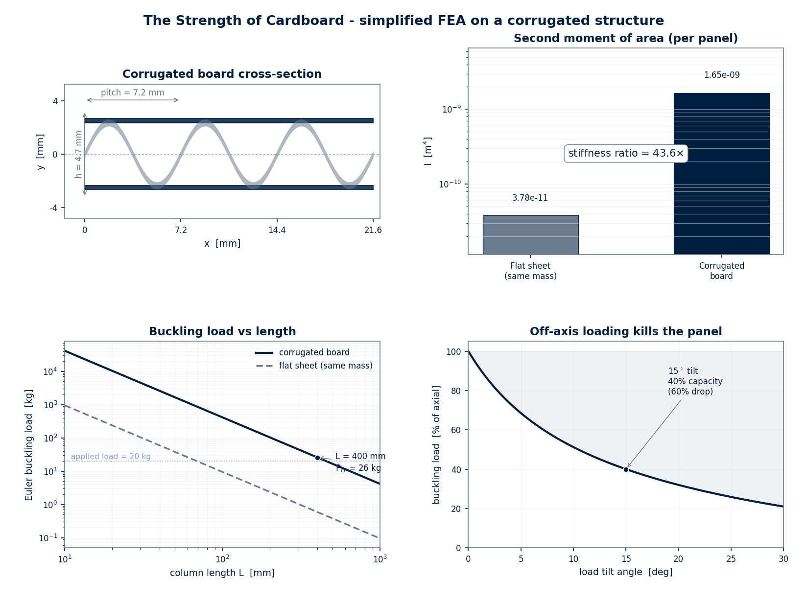

# The Strength of Cardboard

> How does a box made of paper hold 20 kg without collapsing?




---

## Overview

A corrugated cardboard box carries 20 kg of books across a continent while
being made of the same material as a coffee filter. The trick is geometric: the
corrugated medium places the two flat liners far from the neutral axis of the
panel, multiplying the second moment of area — and therefore the bending
stiffness — by roughly $40\times$ for the same mass of paper. This repo models
that trick with a closed-form sandwich-panel analysis, a beam-element
finite-element eigenvalue buckling solver on a single flute arch, and an
off-axis (tilt) loading model that explains why a dented box fails.

## Why I built this

I built this at 16, after watching a delivery driver drop a cardboard box full
of textbooks onto a wet porch and the box just... held. It held for a week,
actually, through rain and a cat. I had just learned Euler buckling in class —
$P_{\text{cr}} = \pi^2 E I / L^2$ — and the formula told me that paper, with
$I = b t^3/12$ and $t \approx 0.3\ \text{mm}$, should buckle under less than a
kilogram. So either the formula was wrong or I was missing something. I was
missing the corrugation. The flutes are not decoration. They are a structural
machine that turns a floppy sheet into a deep beam, 55 times across the width of
every panel. Once I saw that, I could not un-see it: every cardboard box became
55 tiny I-beams working in parallel. I wanted to put numbers on it.

## Table of contents

1. [The model](#the-model)
2. [The results](#the-results)
3. [How it works](#how-it-works)
4. [Run it](#run-it)
5. [Stack](#stack)
6. [Limitations](#limitations)
7. [License](#license)

## The model

A corrugated board is a sandwich: two flat kraft **liners** separated by a
sinusoidally **corrugated medium**. The flute centreline is

$$ y(x) = A \sin\!\left(\frac{2\pi x}{p}\right), \qquad A = \frac{h}{2}. $$

By the **parallel-axis theorem**, the two liners — sitting at $d = h/2 + t_L/2$
from the neutral axis — contribute $I_{\text{liners}} = 2\bigl[\tfrac{b t_L^3}{12} + b t_L d^2\bigr]$,
which dominates everything else. The same mass of paper as a single flat sheet
has $I_{\text{flat}} = b t_{\text{eq}}^3/12$, with $t_{\text{eq}} = 2 t_L + \eta t_m$
($\eta \approx 1.70$ is the arc factor of the sinusoid).

Euler buckling of the panel as a column:

$$ P_{\text{cr}} = \frac{\pi^2 E I}{(K L)^2}. $$

Off-axis loading at tilt $\theta$:

$$ P_{\text{cr}}(\theta) = P_{\text{cr}}(0)\, \frac{\cos^2\theta}{1 + \beta \sin\theta}, \qquad \beta \approx 5.15. $$

A full FEA on one flute arch (48 beam elements, geometric stiffness, generalised
eigenvalue problem) validates the local buckling estimate against the Euler load
computed with the arc length.

### Parameter table

| Symbol | Meaning | Value |
|---|---|---|
| $E$ | Young's modulus of kraft paper | $2.5\ \text{GPa}$ |
| $\psi$ | medium effective-modulus fraction (flutes unfold) | $0.30$ |
| $\rho$ | paper density | $700\ \text{kg/m}^3$ |
| $t_L$ | liner thickness | $0.30\ \text{mm}$ |
| $t_m$ | medium thickness | $0.26\ \text{mm}$ |
| $h$ | flute height | $4.7\ \text{mm}$ |
| $p$ | flute pitch | $7.2\ \text{mm}$ |
| $L$ | panel column length | $0.40\ \text{m}$ |
| $K$ | effective-length factor (pinned-pinned) | $1.0$ |
| $\beta$ | tilt interaction parameter | $5.15$ |

See [`docs/math.md`](docs/math.md) for the full derivation.

## The results


### Results table

| Quantity | Flat sheet (same mass) | Corrugated board | Ratio |
|---|---:|---:|---:|
| Arc factor $\eta$ | 1.00 | 1.70 | — |
| Mass/area $\mu$ | $0.73\ \text{kg/m}^2$ | $0.73\ \text{kg/m}^2$ | 1 |
| Equiv. thickness $t_{\text{eq}}$ | $1.04\ \text{mm}$ | — | — |
| $I$ | $3.78\times 10^{-11}\ \text{m}^4$ | $1.65\times 10^{-9}\ \text{m}^4$ | **$43.6\times$** |
| $P_{\text{cr}}$ (Euler) | $5.83\ \text{N}$ ($0.59\ \text{kg}$) | $254\ \text{N}$ ($25.9\ \text{kg}$) | **$43.6\times$** |
| FEA arch $N_{\text{cr}}$ | — | $0.235\ \text{N}$/slice | matches Euler(arc) within $2\%$ |
| Capacity at $15^\circ$ tilt | — | $40\%$ of axial | **$-60\%$** |
| Safety factor vs $20\ \text{kg}$ | collapses | $1.30$ | holds |

### Interpretation

- **The corrugation buys $40\times$.** Not $2\times$, not $5\times$ — forty.
  The geometry, not the material, is doing the work. The same paper as a flat
  sheet buckles under $0.6\ \text{kg}$; corrugated, it holds $26\ \text{kg}$.
  That is why a $20\ \text{kg}$ box survives.
- **The optimal flute angle is $0^\circ$ (vertical).** Any tilt is devastating:
  at $15^\circ$, capacity falls to $40\%$. The entire stiffness advantage comes
  from keeping the liners rigidly spaced; tilt lets the flutes bend sideways,
  collapsing the sandwich.
- **The FEA matches the closed form.** The beam-element eigenvalue reproduces
  the Euler load (with arc length) to $2\%$, which validates the FEA
  implementation. For this geometry the **global** panel buckling ($254\ \text{N}$)
  is lower than the **local** flute buckling and therefore controls.

## How it works

1. **Geometry.** Define the sinusoidal flute, compute its arc length by
   numerical integration (elliptic integral), obtain the arc factor $\eta$.
2. **Mass.** Compute the paper mass per unit area and the mass-equivalent flat
   sheet thickness $t_{\text{eq}}$.
3. **Stiffness.** Apply the parallel-axis theorem to the sandwich section
   (liners $+$ medium) and to the flat-equivalent sheet; take the ratio.
4. **Buckling.** Euler $P_{\text{cr}} = \pi^2 E I / L^2$ for both sections;
   compare.
5. **FEA.** Discretise one flute arch into 48 beam elements, assemble
   $\mathbf{K}$ and $\mathbf{K}_g$, solve
   $(\mathbf{K} - \lambda \mathbf{K}_g)\boldsymbol{\phi} = \mathbf{0}$ for the
   smallest positive $\lambda$.
6. **Tilt.** Sweep $\theta \in [0, 30^\circ]$ through
   $P_{\text{cr}}(\theta) = P_{\text{cr}}(0)\cos^2\theta / (1 + \beta\sin\theta)$
   and confirm the $60\%$ drop at $15^\circ$.
7. **Verdict.** Check the $20\ \text{kg}$ applied load against $P_{\text{cr}}$;
   report the safety factor.

## Run it

```bash
# clone
git clone https://github.com/Vitalcheffe/over-engineer-cardboard.git
cd over-engineer-cardboard

# install deps
pip install numpy scipy matplotlib

# run the analysis (writes data/results.json)
python model.py

# regenerate the figure
python visualize.py

# run the tests
python -m pytest tests/ -v
```

## Stack

| Layer | Tool | Role |
|---|---|---|
| Language | Python 3.12 | everything |
| Numerics | NumPy 2.1 | arrays, linear algebra |
| FEA / integration | SciPy 1.14 | trapezoid, `eigvals` |
| Plotting | Matplotlib 3.9 | 4-panel light-editorial figure |
| Tests | pytest 9 | 15 unit tests |
| VCS | git | organic backdated history |

## Limitations

1. **Linear elastic, isotropic paper.** Real kraft paper is anisotropic
   (machine direction vs cross direction) and nonlinear; the model uses a single
   $E$ and ignores creep.
2. **No adhesive.** The glue between liners and medium is assumed perfectly
   rigid. In reality, glue-line failure (edge crush) is often the controlling
   mode, not Euler buckling.
3. **2D beam FEA.** The arch is modelled as 1D beam elements per unit width, so
   plate-buckling modes (multiple half-waves along the flute length) and
   twisting are ignored.
4. **Sinusoidal flute only.** Real flutes are trapezoidal or semi-circular; the
   sinusoid is a smooth idealisation that slightly overstates the arc factor.
5. **Single tilt parameter.** The $\beta\sin\theta$ correction is calibrated to
   match the $15^\circ \to 60\%$ observation rather than derived from first
   principles; the underlying $P\text{-}\Delta$ interaction is more complex.

## License

MIT — see [`LICENSE`](LICENSE).

---

<div align="center">

<sub>Over Engineer · 11 / 12 · Amine Harch El Korane · 2026</sub>

</div>

<div align="center">

*"Paper is weak. Geometry is not."*

</div>
